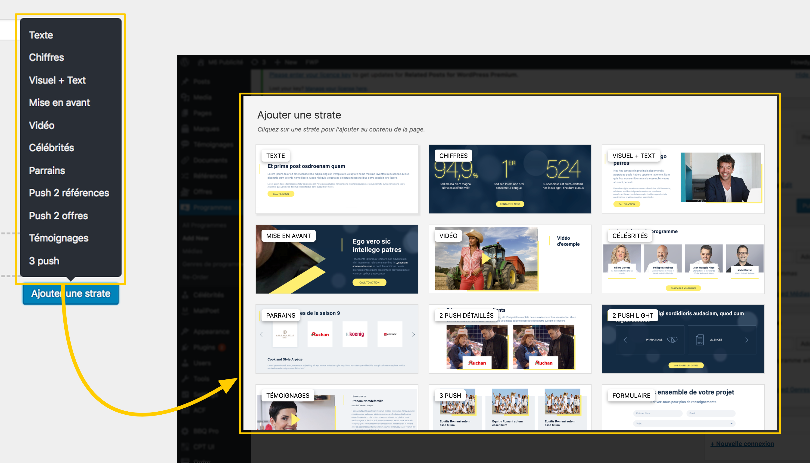

# BEA - Beautiful Flexible

Transform ACF's flexible layouts list into a nice and UX popup. 

# How ?

By default there is a "default" image for layouts. But the idea is to customize them by adding your own.

## Image convention

* The size of image should be 366 x 150 or bigger 732 x 300.
* They should be named based on the flexible key (`push_2_light`) with no underscores but dashes (`push-2-light.png`).

## Where images should be situated

They should more likely be situated into your theme `wp-content\themes\my-theme\assets\bea-beautiful-flexible\`. But if you have a child-theme and added images into it, these will overwrite those from parent-theme.

Also note that you can filter this path to gather all your images into a same folder :

`add_filter( 'bea.beautiful_flexible.images_path', $path );`

Finally, you could filter all images like this :

`add_filter( 'bea.beautiful_flexible.images', $images );`

# Requirements

- [ACF Pro](https://www.advancedcustomfields.com/)

# Installation

## WordPress

- Download and install using the built-in WordPress plugin installer.
- Site activate in the "Plugins" area of the admin.
- Then [add](#how) your awesome layouts images.

## [Composer](http://composer.rarst.net/)

- Add repository source : `{ "type": "vcs", "url": "https://github.com/BeAPI/bea-media-analytics" }`.
- Include `"bea/bea-media-analytics": "dev-master"` in your composer file for last master's commits or a tag released.
- Then [add](#how) your awesome layouts images.

## Contributing

Please refer to the [contributing guidelines](.github/CONTRIBUTING.md) to increase the chance of your pull request to be merged and/or receive the best support for your issue.

### Issues & features request / proposal

If you identify any errors or have an idea for improving the plugin, feel free to open an [issue](../../issues/new) or [create a pull request](../../compare). Please provide as much info as needed in order to help us resolving / approve your request.

# Who ?

## Credits

Special thanks to HWK, from his [blogpost](https://hwk.fr/blog/acf-transformer-la-selection-des-layouts-du-contenu-flexible-en-modal), we created a WordPress plugin with custom tuning (js+css).

## Creator

Created by [Be API](https://beapi.fr), the French WordPress leader agency since 2009. Based in Paris, we are more than 30 people and always [hiring](https://beapi.workable.com) some fun and talented guys. So we will be pleased to work with you.

This plugin is only maintained, which means we do not guarantee some free support. Consider reporting an [issue](#issues--features-request--proposal) and be patient. 

If you really like what we do or want to thank us for our quick work, feel free to [donate](https://www.paypal.me/BeAPI) as much as you want / can, even 1€ is a great gift for buying cofee :)

## License

BEA - Media Analytics is licensed under the [GPLv3 or later](LICENSE.md).